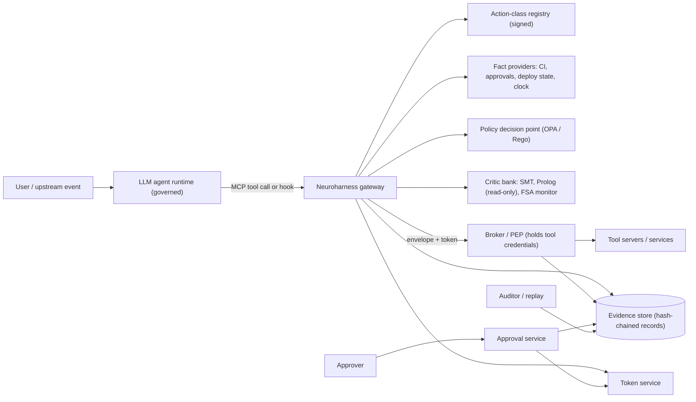
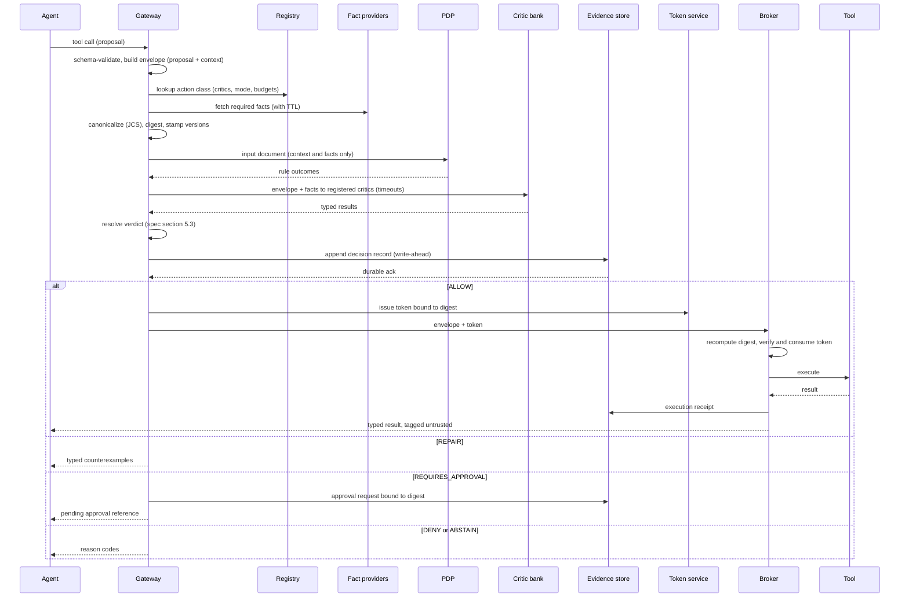
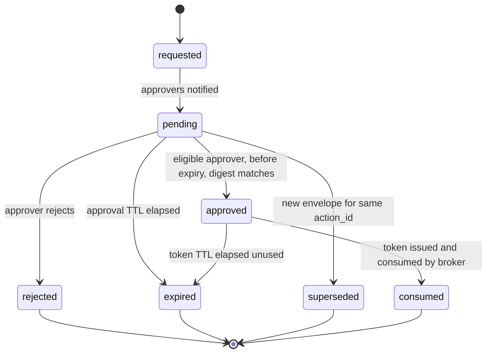

# Neuroharness Technical Plan

**Status:** Draft v0.1 — ready for review · **Date:** 2026-09-18 · **Implements:** `01-specification.md` · **Constrained by:** `00-constitution.md`, `04-threat-model.md`

## 1. Design principles applied

1. **Small trusted computing base.** The components that can produce an `ALLOW` (envelope builder, PDP, hard critics, verdict resolver, token service, broker, evidence store) are few, typed, and independently testable. Everything else is advisory.
2. **Write-ahead evidence.** The decision record is persisted before a token exists.
3. **Digest everywhere.** The envelope digest is the identity of an action across evaluation, approval, token, execution and audit.
4. **Deterministic core, bounded non-determinism.** Solvers run with timeouts and seeds; a timeout can only move a verdict toward `ABSTAIN`.
5. **Registry-driven.** Which critics run, in which mode, with what budgets, is data (signed, versioned), not code.
6. **Same path in every mode.** Shadow, advisory and enforce differ only in whether the broker consults the verdict; evaluation and recording are identical, so shadow data is representative.

## 2. Architecture

### 2.1 Context (C4 level 1)



### 2.2 Containers and trust zones (C4 level 2)

| Container | Zone | Responsibilities | Writes to | Credentials held |
|---|---|---|---|---|
| Gateway | Control plane | Interception, envelope building, fact fetch, orchestration of PDP/critics, verdict resolution, repair responses | Evidence store | Fact-provider read tokens only |
| Hook adapter (library) | Governed runtime | Translates framework tool-call events into gateway requests; cannot execute tools itself | — | None |
| Registry service | Control plane | Serves signed action-class registry; verifies signatures | — | None |
| PDP (OPA) | Control plane, sandboxed | Evaluates signed Rego bundles on harness-built input | — | None |
| Critic workers | Control plane, sandboxed (no egress) | SMT, Prolog, monitor evaluation with timeouts and memory limits | Monitor state store | None |
| Monitor state store | Control plane | Per-session FSA state, resource locks | — | — |
| Token service | Control plane | Issue / verify / consume single-use tokens; nonce store | Nonce store | Token key (KMS) |
| Approval service + UI | Control plane | Approval state machine, eligibility, notifications | Evidence store | Identity-provider client |
| Broker / PEP | Execution plane | Digest recompute, token verify+consume, tool execution, result typing, receipts | Evidence store | **All** tool credentials |
| Evidence store | Audit plane | Append-only records, hash chain, checkpoints, export | Object storage (anchors) | Signing key for checkpoints |

The governed runtime is outside every trust zone. It can reach only the gateway (for proposals) and receives only typed responses.

### 2.3 Deployment topology (v1 reference)
- Gateway, PDP sidecar, critic workers and token service run as one Kubernetes pod group (or Compose stack) per tenant; PDP and critics have `NetworkPolicy` deny-all egress except the gateway.
- Broker runs in a separate pod with the tool credentials; only the gateway's service identity may call it (mTLS / SPIFFE identity).
- Evidence store is PostgreSQL (append-only table, row-level hash chain) with periodic signed checkpoints written to object storage.
- Monitor state and token nonces use the same PostgreSQL instance in v1 (Redis is an option later; `ADR-0009`).

## 3. Request lifecycle



Timing budget per stage (`NFR-01`–`NFR-03`): schema+build ≤ 3 ms; fact fetch (cached, parallel) ≤ 20 ms p95; PDP ≤ 10 ms; SMT critic ≤ 200 ms timeout; monitor ≤ 5 ms; record write ≤ 10 ms; token issue ≤ 2 ms.

## 4. Components

### 4.1 Gateway and adapters
- **MCP gateway**: a Model Context Protocol server that advertises the registered tools to the agent host and proxies calls. It is the only tool endpoint the agent host is configured with. Implemented with the Python MCP SDK.
- **Hook adapter**: a thin library for frameworks with pre-tool-call hooks (agent SDKs with `PreToolUse`-style hooks, LangGraph tool-node middleware). The adapter forwards the call to the gateway and returns the gateway's decision; it never executes tools. Decision `OQ-04` determines whether v1 ships one adapter or the gateway only.
- **Response contract**: the gateway returns one of `{verdict, reason_codes[], counterexamples[], approval_ref?, result?}`; free text is never emitted.

### 4.2 Envelope builder and canonicalization
- Validates the proposal against the tool's argument schema and the envelope schema (`FR-02`).
- Constructs `context` from the authenticated session (actor, delegation chain from the identity layer, environment from deployment config), the registry entry, fetched facts, bundle and critic versions, trace IDs (`FR-03`, `FR-04`).
- Strips any context-shaped keys from the proposal, recording that it did so.
- Canonicalizes with RFC 8785 (JCS) and computes SHA-256. The digest is computed once and carried; the broker recomputes independently (`FR-21`).

### 4.3 Fact providers
- Interface: `get(fact_name, key) -> Fact{value, source, fetched_at, ttl_seconds, provider_version, digest}` with a bounded timeout.
- v1 providers: CI result (per `(service, version)`), change approval (per `(service, version, target)`), deployment state (currently deployed version, in-flight deployments), trusted clock, identity/delegation resolver.
- Results are cached with TTL; staleness is evaluated against the *rule's* max age, not the cache's (`FR-11`).
- Provider failures produce `FACT_MISSING` (`FR-13`). Providers are enumerated in the TCB inventory.

### 4.4 Action-class registry (`FR-30`–`FR-33`)
Signed YAML/JSON document, versioned, loaded at start and hot-reloaded atomically.

```yaml
registry_version: 2026.09.18-1
default_mode: strict
action_classes:
  - tool: deployment.apply
    intent: deploy_service
    source_requirements: [WF-01, WF-02, WF-03, WF-04, WF-05, WF-06]
    required_facts:
      - {name: ci_result, key: [service, version], max_age_seconds: 900}
      - {name: change_approval, key: [service, version, target], max_age_seconds: 3600}
      - {name: deploy_state, key: [service, target], max_age_seconds: 60}
    critics:
      - {id: pdp.deploy, kind: rego, package: neuroharness.deploy, hard: true}
      - {id: smt.version-contract, kind: smt, contract: contracts/version.smt.yaml, hard: true, timeout_ms: 200}
      - {id: fsa.deploy-order, kind: monitor, properties: [WF-06], hard: true, mode: shadow, certified_model: null}
      - {id: prolog.deploy-hints, kind: prolog, hard: false, timeout_ms: 100}
    mode: enforce
    approvable: true
    abstain_escalates_to_approval: false
    repair_budget: 3
    token_ttl_seconds: 60
    approval_ttl_seconds: 86400
    approver_groups: [release-managers]
```

Per-critic `mode` may be stricter than the class mode (a monitor can be `shadow` while the class is `enforce`). Unregistered `(tool, intent)` → `ABSTAIN` in `strict` (`FR-31`).

### 4.5 Policy decision point
- OPA running as a sidecar with signed bundles (`opa build --signing-key`, verified on load) (`SEC-05`). An in-process WASM evaluator is an accepted alternative for library deployments (`ADR-0009`).
- Rego v1 syntax; one package per workflow; rule outcomes returned as sets so the gateway records every rule's result (`FR-72`).
- Input document is built by the gateway and contains **no** `claims` key by construction (`SEC-01`); a schema test asserts this.

```rego
package neuroharness.deploy

import rego.v1

deny contains {"rule": "WF-01", "repairable": false} if {
    not data.registry.allowlist[input.environment][input.action.tool]
}

deny contains {"rule": "WF-04", "repairable": false} if {
    input.facts.ci_result.value.status == "failed"
}

abstain contains {"rule": "WF-04", "reason": "FACT_MISSING:ci_result"} if {
    not input.facts.ci_result
}

abstain contains {"rule": "WF-04", "reason": "FACT_STALE:ci_result"} if {
    input.facts.ci_result.age_seconds > data.registry.fact_max_age.ci_result
}

requires_approval contains {"rule": "WF-02"} if {
    input.action.arguments.target == "production"
}
```

Policy quality gates: `opa test` with coverage ≥ 95% of rules, Regal lint clean, and one killing mutation fixture per hard rule (`05-evaluation-plan.md` §4).

### 4.6 Approval service (`FR-40`–`FR-46`)



- Eligibility: approver ∈ registry `approver_groups`, human principal from the identity provider, not the agent, not the proposing principal, not in the delegation chain (`FR-42`).
- The approval payload shown and signed by the approver includes the digest; a token is issued only if the current envelope digest equals the approved digest (`FR-44`).
- Minimal v1 surface: REST API + CLI + a plain web page; chat-ops integrations later.

### 4.7 Critic bank
Common contract (`FR-55`, `FR-56`): `evaluate(envelope, facts, session_state) -> CriticResult{critic_id, version, result, counterexample?, duration_ms}`; each critic runs in a worker with CPU/memory limits and a hard timeout; results are Pydantic models validated against the decision-record schema.

**SMT critic (`FR-51`)** — Z3 via `z3-solver`. Contracts are declared per action class in a small YAML DSL that compiles to QF_LIA/QF_BV assertions over typed argument and fact bindings (no quantifiers, no strings beyond enumerations). The critic asserts the negation of the contract and asks for satisfiability: `unsat` → `PASS`; `sat` → `FAIL` with the model as the counterexample (offending variables and values); `unknown`/timeout → `UNKNOWN`. Seed and resource limits are fixed for determinism.

**Prolog critic (`FR-62`, prototype, soft)** — SWI-Prolog in a sandboxed container loading a harness-owned, signed rulebase at startup. The exposed interface is a single typed `query(goal_name, args)` with a depth/time limit. No `consult`, `assert`, `retract` or `replace` is reachable. Results are explanatory (which rules fired) and recorded as soft signals until the registry promotes a rule to hard after mutation testing.

**Trajectory monitor (`FR-52`–`FR-54`)** — Temporal properties are written in a bounded LTLf subset (precedence, bounded response, absence, at-most-one-in-flight) and compiled to deterministic finite automata at bundle-build time. The monitor consumes events `proposed`, `allowed`, `executed(receipt)`, `approval_granted`, `denied`, keyed by session and by resource key (e.g. `(service, target)`). State is persisted transactionally; a missing state row yields `ABSTAIN` (`MONITOR_STATE_LOST`). The monitor cannot be set to `enforce` for an action class without a certification record naming the governed model (`FR-53`, `FR-54`).

### 4.8 Verdict resolver (`FR-05`)
Pure function over `{pdp_outcomes, critic_results, fact_status, registry_entry, repair_iteration}` implementing `01-specification.md` §5.3. Table-driven tests enumerate all result combinations; property-based tests assert monotonicity (adding a failure never moves the verdict toward `ALLOW`).

### 4.9 Token service (`FR-20`–`FR-23`)
- Token = `{decision_id, envelope_digest, policy_bundle_digest, tenant, issued_at, expires_at, nonce}`, signed with Ed25519 (multi-service) or HMAC-SHA256 (single deployment) using a KMS-held key.
- `consume(token, digest)` is an atomic conditional insert into the nonce table; second consumption fails (`FR-22`).
- Issued only after the evidence store acknowledges the record (`FR-23`).

### 4.10 Broker / PEP (`FR-21`, `FR-24`, `FR-63`)
- Recomputes the digest of the envelope it receives; verifies token signature, expiry, digest equality, tenant; consumes the nonce; only then executes.
- Executes via tool-specific connectors with least-privilege credentials scoped to the action class.
- Types the result against the tool's output schema, truncates to a size bound, tags it `untrusted`, appends the receipt (`FR-24`), returns to the gateway.
- Runs in shadow/advisory modes too: it executes without consulting the verdict but still requires a *shadow token* so the same code path is exercised (`FR-80`).

### 4.11 Evidence store (`FR-70`–`FR-74`, `SEC-10`)
- PostgreSQL table `decision_records` with `record_id`, `tenant_id`, `seq`, `prev_record_hash`, `record_hash`, `payload jsonb` conforming to `schemas/decision-record.schema.json`; inserts are the only permitted write; triggers reject updates and deletes.
- Hourly signed checkpoint `(tenant, last_seq, last_hash, signature)` written to object storage; verification tool recomputes the chain.
- Replay tool reconstructs a verdict from a record, the referenced bundle and critic versions (`FR-71`).
- Export: JSONL + checkpoint for auditors (`FR-73`).
- Privacy: principals stored as stable pseudonymous IDs with a per-tenant key; crypto-shredding supports erasure without breaking the chain (`NFR-16`).

### 4.12 Repair channel (`FR-90`–`FR-92`)
Counterexamples are returned as the gateway's typed response. The governed runtime's own scaffold decides how to present them to the model; the harness supplies no natural-language text. Iterations share `action_id`; the budget is enforced by the resolver.

## 5. Data model and interfaces

### 5.1 Core types
| Type | Schema | Notes |
|---|---|---|
| Action envelope | `schemas/action-envelope.schema.json` | `proposal` + `context`; digest over the whole. |
| Decision record | `schemas/decision-record.schema.json` | One per evaluation; approval and receipt appended as sub-records linked by `decision_id`. |
| Decision token | defined in `decision-record.schema.json#/$defs/DecisionToken` | Opaque to the agent. |
| Registry entry | §4.4 example; JSON Schema to be generated from the Pydantic model in `P0-05` | Signed as a bundle. |
| Critic result | `decision-record.schema.json#/$defs/CriticResult` | Typed counterexample. |
| PDP input document | built by gateway; JSON Schema generated in `P1-04` | Asserted never to contain `claims`. |

### 5.2 Interfaces
| Interface | Protocol | Consumer |
|---|---|---|
| Tool proxy | MCP (stdio / streamable HTTP) | Agent host |
| Hook adapter | in-process library call → HTTP/gRPC to gateway | Agent framework |
| Decision API | HTTP/JSON `POST /v1/evaluate`, `GET /v1/decisions/{id}` | Adapters, operators |
| Broker API | mTLS HTTP `POST /v1/execute` (envelope + token) | Gateway only |
| Approval API | HTTP/JSON `POST /v1/approvals/{id}:approve|reject`; UI | Approvers |
| Evidence export | CLI `nh evidence export --tenant --from --to` | Auditors |
| Replay | CLI `nh replay --corpus` | CI, auditors |
| Health | `GET /healthz` (`FR-82`) | Operators |

## 6. Technology decisions

| Concern | Decision | ADR |
|---|---|---|
| Implementation language | Python 3.12+, typed (mypy strict), Pydantic v2 models exported to JSON Schema 2020-12 | `ADR-0009` |
| Policy engine | OPA with Rego v1; signed bundles; sidecar default, WASM in-process option | `ADR-0001`, `ADR-0009` |
| Canonicalization / digest | RFC 8785 JCS + SHA-256 | `ADR-0008` |
| Tokens | Ed25519 or HMAC via KMS; single-use nonce table | `ADR-0008` |
| SMT | Z3 (`z3-solver`), QF_LIA/QF_BV, 200 ms timeout | `ADR-0002` |
| Prolog prototype | SWI-Prolog, harness-owned signed rulebase, query-only MCP wrapper | `ADR-0002`, `FR-62` |
| Temporal monitor | LTLf subset → DFA at build time; state in PostgreSQL | `ADR-0002`, `FR-52` |
| Evidence store | PostgreSQL append-only + signed checkpoints to object storage | `ADR-0006` |
| Interception | MCP gateway (primary) + hook adapter (secondary) | `ADR-0001` |
| Constrained decoding | Not a harness responsibility; schema validation at the boundary only | `ADR-0003` |
| Rollout | shadow → advisory → enforce per action class and per critic | `ADR-0010` |
| Observability | OpenTelemetry (traces, metrics), structured JSON logs | — |
| Packaging | `uv` with lockfile; distroless containers; CycloneDX SBOM; build provenance attestations; cosign-signed images and bundles | `06-delivery-and-governance.md` §4 |

## 7. Observability

- **Traces:** one trace per `action_id`; spans per stage (`build`, `facts`, `pdp`, `critic:<id>`, `resolve`, `record`, `token`, `execute`); attributes follow OpenTelemetry GenAI semantic conventions where applicable (tool name, agent id) plus `nh.verdict`, `nh.reason_codes`, `nh.mode`, `nh.bundle_digest`.
- **Metrics:** `nh_verdicts_total{class,verdict,reason,mode}`, `nh_stage_latency_seconds{stage}` histograms, `nh_tokens_issued_total`, `nh_tokens_rejected_total{reason}`, `nh_approvals_pending`, `nh_approval_latency_seconds`, `nh_fact_age_seconds{fact}`, `nh_monitor_state_rows`, `nh_bundle_info{version,digest}`.
- **Alerts (initial):** token reuse attempt; `POLICY_ENGINE_UNAVAILABLE` or `BUNDLE_INTEGRITY_FAILED` > 0 in 1 min; `EVIDENCE_UNAVAILABLE` > 0; missing receipt after token expiry; false-block rate above threshold in shadow (see `05-evaluation-plan.md`).
- **Logs:** structured; never include secrets, tokens, or model free text (`NFR-18`).

## 8. Testing strategy

| Level | What | Tooling | Gate |
|---|---|---|---|
| Unit | Resolver, canonicalization, token service, schema models | pytest, hypothesis (property-based: monotonicity, idempotent canonicalization) | 100% of resolver branches; ≥ 90% line coverage on TCB packages |
| Policy unit | Every Rego rule, positive and negative | `opa test --coverage`, Regal | ≥ 95% rule coverage, lint clean |
| Mutation (policy) | `MUT-01`–`MUT-18` negative fixtures must be blocked | fixture runner (`nh mutations run`) | 100% kill for hard gates (blocking) |
| Mutation (code) | Harness TCB packages | mutmut | ≥ 80% mutation score (non-blocking until Phase 2, then blocking) |
| Contract | Adapter ↔ gateway, gateway ↔ broker, critic contract | schema tests, pact-style fixtures | blocking |
| Behaviour | `A-01`…`A-27` Gherkin | pytest-bdd | blocking |
| Integration | Gateway + OPA + PostgreSQL + broker in Compose | pytest + testcontainers | blocking |
| Replay | Golden decision corpus reproduces verdicts | `nh replay` | 0 diffs (blocking) |
| Adversarial / bypass | Tampering, replay, substitution, injection through results, approval abuse | red-team fixtures (`05-evaluation-plan.md` §7) | blocking from Phase 4 |
| Performance | `NFR-01`–`NFR-04` | k6 or locust against Compose stack | non-blocking report in Phase 1, blocking thresholds from Phase 2 |
| Security | SAST, dependency audit, secret scan, container scan | CodeQL, pip-audit, gitleaks, Trivy | blocking |

## 9. Delivery pipeline (summary; details in `06-delivery-and-governance.md`)
`lint+typecheck → unit → policy unit+lint → mutation fixtures → behaviour → integration → replay → security scans → SBOM+provenance → sign → publish`. Any red stage blocks merge; there is no manual override for mutation or replay stages.

## 10. Repository layout (target)

```
src/neuroharness/
  gateway/        MCP server, hook adapter API, envelope builder, canonicalization
  registry/       registry models, loader, signature verification
  facts/          provider interface + v1 providers
  pdp/            OPA client, input-document builder, outcome mapping
  critics/        base contract; smt/, prolog/, monitor/
  resolve/        verdict resolver
  tokens/         issue / verify / consume
  broker/         PEP, connectors, result typing, receipts
  evidence/       store, hash chain, checkpoints, export, replay
  approvals/      state machine, eligibility, API, minimal UI
  observability/  OTel setup, metrics
policy/
  deploy/         *.rego, *_test.rego
  bundles/        build + signing scripts
critics/
  contracts/      SMT contract YAML
  rulebase/       Prolog rulebase (signed)
  temporal/       LTLf property files
fixtures/
  mutations/      MUT-*.json
  golden/         replay corpus
  trajectories/   adversarial corpora for monitor certification
docs/sdd/         this package
```

## 11. Design risks and open technical questions
| Item | Mitigation / owner |
|---|---|
| Fact-provider latency dominates the policy-only budget | Parallel fetch, short-TTL cache, per-provider timeouts; measure in `P1-13`. |
| SMT contract DSL scope creep | Restrict to QF_LIA/QF_BV enumerations; anything else is a new ADR. |
| Monitor certification cost per model change | Automate corpus generation and the entropy test (`P3-03`, `P3-04`); budget it in the model-change runbook. |
| Approval fatigue in production | Track `nh_approvals_pending` and approval latency; tune `approvable` classes; never auto-approve. |
| OPA sidecar vs in-process divergence | One bundle, two evaluators, same conformance suite in CI. |
| Hook adapter bypass (framework calls tools directly) | Broker holds credentials; document the deployment requirement; bypass fixture in `P4-05`. |
