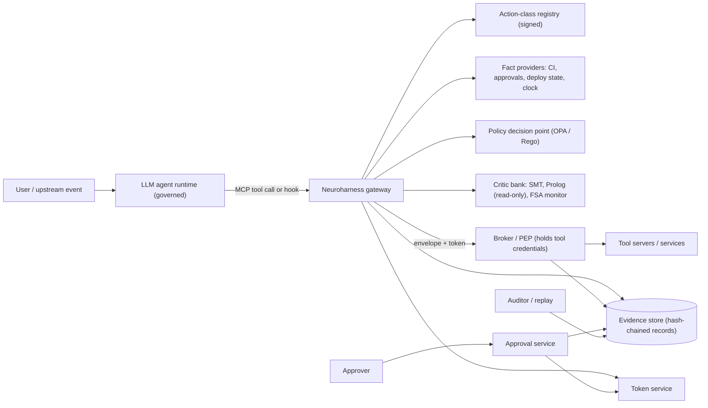
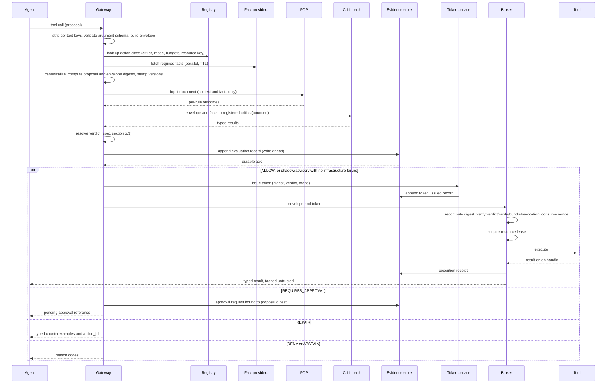
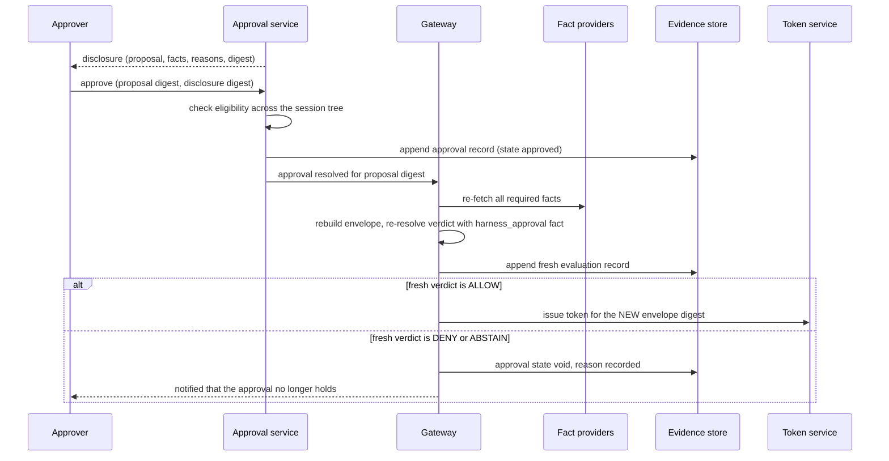
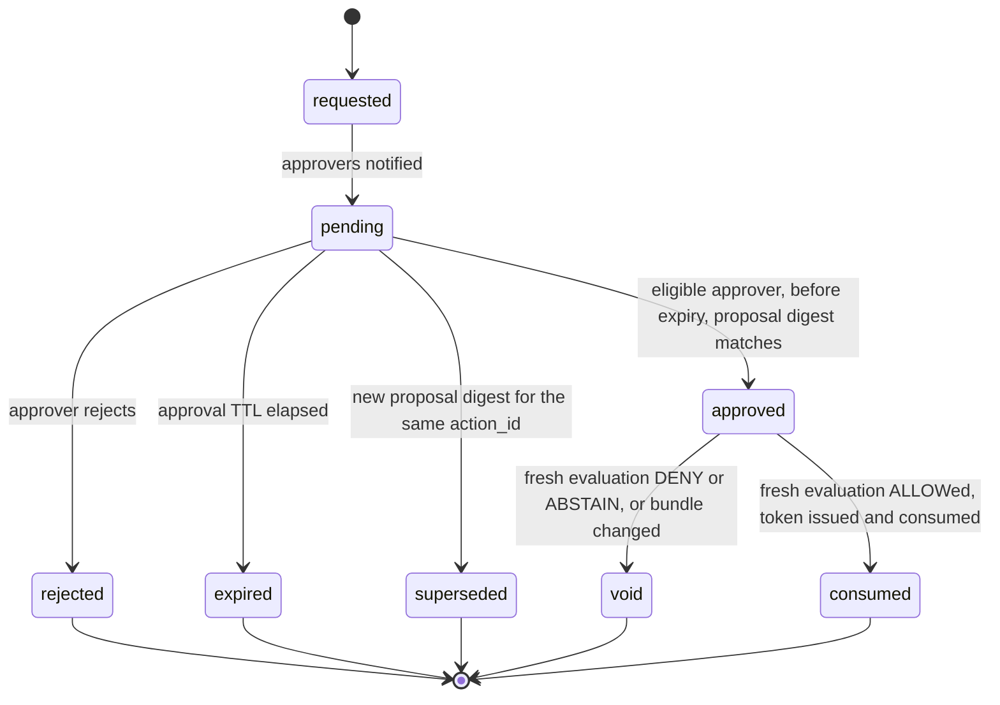

# Neuroharness Technical Plan

**Status:** Draft v0.2 — revised after round-two review · **Date:** 2026-09-18 · **Implements:** `01-specification.md` · **Constrained by:** `00-constitution.md`, `04-threat-model.md`

## 1. Design principles applied

1. **Small trusted computing base.** The components that can produce an `ALLOW` (envelope builder, PDP, hard critics, verdict resolver, token service, broker, evidence store) are few, typed, and independently testable. Everything else is advisory.
2. **Write-ahead evidence.** The decision record is persisted before a token exists.
3. **Digest everywhere.** The envelope digest is the identity of an action across evaluation, approval, token, execution and audit.
4. **Deterministic core, bounded non-determinism.** Solvers run with timeouts and seeds; a timeout can only move a verdict toward `ABSTAIN`.
5. **Registry-driven.** Which critics run, in which mode, with what budgets, is data (signed, versioned), not code.
6. **Same path in every mode.** Shadow, advisory and enforce differ only in whether the broker consults the *verdict*; evaluation, recording and token issuance are identical, so shadow data is representative. Infrastructure failures block in every mode (`INV-03`, `FR-80`); `halted` denies everything.
7. **Two identities per action.** The *proposal digest* is what a human approves and what survives re-evaluation; the *envelope digest* is what a token authorizes. Conflating them either freezes stale evidence or voids every approval (`ADR-0008`).
8. **Enforcement that cannot wait for certification lives in the broker.** Mutual exclusion is a lease, not a monitor property, so it holds from day one (`FR-25`).

## 2. Architecture

### 2.1 Context (C4 level 1)



### 2.2 Containers and trust zones (C4 level 2)

| Container | Zone | Responsibilities | Writes to | Credentials held |
|---|---|---|---|---|
| Gateway | Control plane | Interception, envelope building, fact fetch, orchestration of PDP/critics, verdict resolution, repair responses | Evidence store | Fact-provider read tokens only |
| Hook adapter (library) | Governed runtime | Translates framework tool-call events into gateway requests; cannot execute tools itself | — | None |
| Registry service | Control plane | Serves signed action-class registry; verifies signatures | — | None |
| PDP (OPA) | Control plane, sandboxed | Evaluates signed Rego bundles on harness-built input | — | None |
| Critic workers | Control plane, sandboxed (no egress) | SMT, Prolog, monitor evaluation with timeouts and memory limits | Monitor state store | None |
| Monitor state store | Control plane | Per-session FSA state, resource locks | — | — |
| Token service | Control plane | Issue / verify / consume single-use tokens; nonce store | Nonce store | Token key (KMS) |
| Approval service + UI | Control plane | Approval state machine, eligibility, notifications | Evidence store | Identity-provider client |
| Broker / PEP | Execution plane | Digest recompute, token verify+consume, tool execution, result typing, receipts | Evidence store | **All** tool credentials |
| Evidence store | Audit plane | Append-only records, hash chain, checkpoints, export | Object storage (anchors) | Signing key for checkpoints |

The governed runtime is outside every trust zone. It can reach only the gateway (for proposals) and receives only typed responses.

### 2.3 Deployment topology (v1 reference)
- Gateway, PDP sidecar, critic workers and token service run as one Kubernetes pod group (or Compose stack) per tenant; PDP and critics have `NetworkPolicy` deny-all egress except the gateway.
- Broker runs in a separate pod with the tool credentials; only the gateway's service identity may call it (mTLS / SPIFFE identity).
- Evidence store is PostgreSQL (append-only table, row-level hash chain) with periodic signed checkpoints written to object storage.
- Monitor state and token nonces use the same PostgreSQL instance in v1 (Redis is an option later; `ADR-0009`).

## 3. Request lifecycle



**Approval resolution is a second evaluation, not a deferred token** (`FR-47`, `ADR-0008`):



Timing budget per stage (`NFR-01`–`NFR-03`): strip/validate/build ≤ 3 ms; fact fetch (cached, parallel) ≤ 20 ms p95; PDP ≤ 10 ms; SMT critic bounded by solver rlimit with a 200 ms wall-clock backstop; monitor ≤ 5 ms; record write ≤ 10 ms; token issue ≤ 2 ms; lease acquisition ≤ 5 ms. Measured against the performance environment (`P1-25`), not asserted.

## 4. Components

### 4.1 Gateway and adapters
- **MCP gateway**: a Model Context Protocol server that advertises the registered tools to the agent host and proxies calls. It is the only tool endpoint the agent host is configured with. Implemented with the Python MCP SDK.
- **Hook adapter**: a thin library for frameworks with pre-tool-call hooks (agent SDKs with `PreToolUse`-style hooks, LangGraph tool-node middleware). The adapter forwards the call to the gateway and returns the gateway's decision; it never executes tools. Decision `OQ-04` determines whether v1 ships one adapter or the gateway only.
- **Response contract**: the gateway returns one of `{verdict, reason_codes[], counterexamples[], approval_ref?, result?}`; free text is never emitted.

### 4.2 Envelope builder and canonicalization
- Validates the proposal against the tool's argument schema and the envelope schema (`FR-02`).
- Constructs `context` from the authenticated session (actor, delegation chain from the identity layer, environment from deployment config), the registry entry, fetched facts, bundle and critic versions, trace IDs (`FR-03`, `FR-04`).
- Strips any context-shaped keys from the proposal, recording that it did so.
- Canonicalizes with RFC 8785 (JCS) and computes **two** SHA-256 digests: the *proposal digest* over `proposal + actor + action_class + policy_bundle` (what approvals bind to) and the *envelope digest* over the whole object (what tokens bind to). Both are carried; the broker recomputes the envelope digest independently (`FR-04`, `FR-21`).

### 4.3 Fact providers
- Interface: `get(fact_name, key) -> Fact{value, source, asserted_by, observed_at, fetched_at, ttl_seconds, provider_version, digest}` with a bounded timeout. Providers are entries in a signed **fact-provider registry** (`FR-14`) carrying trust level, authentication and a `value_schema`.
- v1 providers: CI result, change approval (external change record), deployment state, trusted clock, identity/delegation resolver, **harness approval** (`harness_approval`, supplied by the approval service so that oversight enters policy as a fact rather than a side channel, `FR-47`), and **execution completion** for asynchronous actions (`FR-26`).
- **Fact laundering is the main risk here** (`SEC-11`, `T-21`): a provider whose backing system any registered tool can write to is not evidence. Either the backing system is read-only to the tenant's tools, or facts carry `asserted_by` and rules reject evidence asserted by a principal in the delegation chain.
- Staleness is `age > min(fact.ttl_seconds, class.required_facts[].max_age_seconds)` measured on the trusted clock; a stale, missing or errored fact is handed to the PDP and critics as a **status-only stub with no value**, so no rule can read a stale value even if its author forgets the freshness check (`FR-11`, enforced by the envelope schema).
- Provider failures produce `FACT_MISSING` (`FR-13`). Providers are enumerated in the TCB inventory.

### 4.4 Action-class registry (`FR-30`–`FR-33`)
Signed YAML/JSON document, versioned, loaded at start and hot-reloaded atomically.

```yaml
registry_version: 2026.09.18-2
unregistered_class_policy: strict       # FR-31 (was: default_mode)
resource_keys: { $ref: resource-keys.yaml }   # FR-34, signed separately
action_classes:
  - tool: deployment.apply
    intent: deploy_service
    effect_class: write                 # FR-35
    source_requirements: [WF-01, WF-02, WF-03, WF-04, WF-05, WF-06a, WF-06b, WF-06c]
    argument_schema:                    # FR-02: policy-compared args are enumerations
      type: object
      additionalProperties: false
      required: [service, version, target, replicas]
      properties:
        service:  {enum: !ref resource_keys.services}
        version:  {type: string, pattern: '^[0-9]+\.[0-9]+\.[0-9]+$'}
        target:   {enum: [development, test, staging, production]}
        replicas: {type: integer, minimum: 1, maximum: 50}
    resource_key: "service:{service}/target:{target}"   # FR-25, FR-34
    connector_kind: async                              # FR-26
    lease_timeout_seconds: 1800
    required_facts:
      - {name: ci_result,       key: [service, version],         max_age_seconds: 900,  required: true,  escalatable: false}
      - {name: change_approval, key: [service, version, target], max_age_seconds: 3600, required: true,  escalatable: false}
      - {name: deploy_state,    key: [service, target],          max_age_seconds: 60,   required: true,  escalatable: false}
      - {name: harness_approval, key: [proposal_digest],         max_age_seconds: 300,  required: false, escalatable: false}
    critics:
      - {id: pdp.deploy,            kind: rego,    hard: true,  mode: enforce}
      - {id: smt.version-contract,  kind: smt,     hard: true,  mode: enforce, timeout_ms: 200, rlimit: 2000000}
      - {id: fsa.deploy-order,      kind: monitor, hard: true,  mode: advisory, properties: [WF-06a], certified_model: null}
      - {id: effect.deploy-state,   kind: effect,  hard: true,  mode: enforce}   # FR-57
      - {id: prolog.deploy-hints,   kind: prolog,  hard: false, mode: advisory, timeout_ms: 100}
    mode: enforce
    approvable: true
    escalate_on: []                     # spec section 5.5; loader rejects this on a non-approvable class
    approver_groups: [release-managers]
    batch_policy: independent           # FR-07
    repair_budget: 3
    token_ttl_seconds: 60
    approval_ttl_seconds: 86400
```

A per-critic `mode` may only be *less* enforcing than the class mode (a monitor may be `advisory` inside an `enforce` class, never the reverse); the loader rejects the inverse and rejects `escalate_on` on a non-approvable class (`FR-33`). A hard critic whose effective mode is not `enforce` is treated as soft for resolution and records `would_be_verdict` (§5.3 step 0). Unregistered `(tool, intent)` → `ABSTAIN` in `strict` (`FR-31`). Classes with `effect_class` `none`/`read` take the policy-only fast path (`FR-35`).

### 4.5 Policy decision point
- OPA running as a sidecar with signed bundles (`opa build --signing-key`, verified on load) (`SEC-05`). An in-process WASM evaluator is an accepted alternative for library deployments (`ADR-0009`).
- Rego v1 syntax; one package per workflow; rule outcomes returned as sets so the gateway records every rule's result (`FR-72`).
- Input document is built by the gateway and contains **no** `claims` key by construction (`SEC-01`); a schema test asserts this.
- Every bundle ships a **rule inventory** so that passing rules can be recorded, not just failing ones (`FR-50`).
- Policy-compared arguments are matched against registry enumerations with a default-deny rule; no rule may compare a free string (`FR-02`, `T-17`).

```rego
package neuroharness.deploy

import rego.v1

# Default deny for anything not registered: an unknown target can never fall through.
deny contains {"rule": "WF-02", "repairable": false} if {
    not data.registry.targets[input.action.arguments.target]
}

deny contains {"rule": "WF-01", "repairable": false} if {
    not data.registry.allowlist[input.context.actor.environment][input.action.tool]
}

# Evidence rules read facts only, and only fresh ones: a stale fact arrives
# without a value, so `status == "fresh"` is structurally required.
deny contains {"rule": "WF-04", "repairable": false} if {
    input.facts.ci_result.status == "fresh"
    input.facts.ci_result.value.status == "failed"
}

# SEC-11: evidence the agent could have manufactured is not evidence.
deny contains {"rule": "WF-04", "repairable": false} if {
    some hop in input.context.actor.delegation_chain
    input.facts.ci_result.asserted_by == hop.principal
}

abstain contains {"rule": "WF-04", "reason": "FACT_MISSING:ci_result"} if {
    input.facts.ci_result.status in {"missing", "provider_error"}
}

abstain contains {"rule": "WF-04", "reason": "FACT_STALE:ci_result"} if {
    input.facts.ci_result.status == "stale"
}

# WF-03: an unverified delegation hop cannot carry authority.
deny contains {"rule": "WF-03", "repairable": false} if {
    every hop in input.context.actor.delegation_chain {
        not is_authorized_human(hop)
    }
}

is_authorized_human(hop) if {
    startswith(hop.principal, "user:")
    hop.credential_status == "verified"
    data.registry.deploy_rights[hop.principal][input.action.arguments.service][input.action.arguments.target]
}

# WF-02: production needs a resolved harness approval, which arrives as a fact.
requires_approval contains {"rule": "WF-02"} if {
    input.action.arguments.target == "production"
    not approved_for_this_proposal
}

approved_for_this_proposal if {
    input.facts.harness_approval.status == "fresh"
    input.facts.harness_approval.value.proposal_digest == input.context.proposal_digest
    input.facts.harness_approval.value.policy_bundle_digest == input.context.policy_bundle.digest
}
```

Policy quality gates: `opa test` with coverage ≥ 95% of rules, Regal lint clean, and one killing mutation fixture per hard rule (`05-evaluation-plan.md` §4).

### 4.6 Approval service (`FR-40`–`FR-47`)



- Approvals bind to the **proposal digest** and the policy-bundle digest, never to the envelope digest, so an approval survives the fact re-fetch that must happen before anything executes (`ADR-0008`).
- Eligibility: approver ∈ registry `approver_groups`, a human principal from the identity provider, not the agent, not the proposing principal, and not in the delegation chain of *any* session in the session tree (`FR-42`).
- The approve request carries the proposal digest and the digest of the disclosure actually shown; both are recorded (`FR-43`).
- On approval the service appends its record and hands off to the gateway. It never calls the token service. The gateway re-fetches facts, re-resolves, and issues a token only on a fresh `ALLOW` (`FR-47`); otherwise the approval becomes `void` and the approver is told why.
- A bundle transition supersedes pending requests and re-evaluates them (`FR-84`).
- Minimal v1 surface: REST API, CLI and a plain web page; chat-ops later.

### 4.7 Critic bank
Common contract (`FR-55`, `FR-56`): `evaluate(envelope, facts, session_state) -> CriticResult{critic_id, version, result, counterexample?, duration_ms}`; each critic runs in a worker with CPU/memory limits and a hard timeout; results are Pydantic models validated against the decision-record schema.

**SMT critic (`FR-51`)** — Z3 via `z3-solver`. Contracts are declared per action class in a small YAML DSL that compiles to QF_LIA/QF_BV assertions over typed argument and fact bindings (no quantifiers, no strings beyond enumerations; the harness pre-parses version strings into integer tuples so the solver never sees a string). The critic asserts the negation of the contract and asks for satisfiability: `unsat` → `PASS`; `sat` → `FAIL` with the model as the counterexample; solver `unknown` → `UNKNOWN`; wall-clock backstop exceeded → `TIMEOUT`. The **primary bound is Z3's deterministic `rlimit`**, not wall-clock, because a wall-clock bound makes results load-dependent and breaks replay under CI contention; the rlimit used is recorded, and the solver version is part of the critic version (`INV-09`).

**Prolog critic (`FR-62`, optional, soft)** — SWI-Prolog in a sandboxed container loading a harness-owned, signed rulebase at startup. It is invoked **by the gateway only**; there is no agent-facing query interface in v1, because an agent-queryable prover is a policy-probing channel outside the repair budget. No `consult`, `assert`, `retract` or `replace` is reachable. Deferred unless an owner is named (`P2-04`).

**Trajectory monitor (`FR-52`–`FR-54`)** — Temporal properties in a bounded LTLf subset (precedence, bounded response, absence) compiled to deterministic finite automata at bundle-build time (`OQ-09` decides build vs vendor, with the GPL constraint of MONA/Spot-based tooling in scope). Events: `proposed`, `approval_granted`, `allowed`, `executed`, `completed`, `denied`. **Keying:** resource-key properties span sessions and tenanted resources; session properties span the *session tree*, so a sub-agent cannot escape a precedence property by being a new session, and a parent's approval is visible to its children (`FR-06`). Transitions commit in **execution order at the broker**, not proposal order, so parallel and batched calls cannot reorder history (`FR-07`). State is persisted transactionally and versioned by the property-set digest; loss or version mismatch yields `ABSTAIN` (`MONITOR_STATE_LOST`), and a property-set change resets state within a bounded abstention window (`FR-84`). Mutual exclusion is deliberately **not** a monitor property: it is a broker lease (`FR-25`), so it holds before certification.

**Effect critic (`FR-57`)** — Runs on receipt (synchronous) or completion (asynchronous). Compares the typed result and a freshly fetched state fact against the proposal: did the thing that was authorized actually happen, and only that? A mismatch appends an `effect_verification` record with `EFFECT_MISMATCH`, alerts, feeds the monitor, and per policy blocks the next action on that resource key. This is what makes the "output-side gap" claim in §3.1 of the specification true rather than aspirational.

### 4.8 Verdict resolver (`FR-05`)
Pure function over `{pdp_outcomes, critic_results, fact_status, registry_entry, repair_iteration}` implementing `01-specification.md` §5.3. Table-driven tests enumerate all result combinations; property-based tests assert monotonicity (adding a failure never moves the verdict toward `ALLOW`).

### 4.9 Token service (`FR-20`–`FR-23`)
- Token payload is exactly `FR-20`: `{token_id (= nonce), decision_id, envelope_digest, proposal_digest, policy_bundle_digest, record_hash, tenant_id, mode, verdict, issued_at, expires_at, key_id, key_alg, shadow}`. Carrying `verdict` and `mode` is what stops a shadow token being cryptographically indistinguishable from an allow token (`ADR-0008`).
- Signed with ECDSA P-256 by default (broadest KMS support), Ed25519 where the KMS offers it, HMAC-SHA256 only single-process (`ADR-0009`, `OQ-03`). Multiple key IDs are active during rotation; a revocation list covers both `token_id` and `key_id`.
- `consume(token, digest)` is an atomic conditional insert into the nonce table; second consumption fails (`FR-22`).
- Issued only after the evidence store acknowledges the evaluation record, and the issuance itself is appended as a `token_issued` record, so the evaluation record never contains the token it precedes (`FR-23`).

### 4.10 Broker / PEP (`FR-21`, `FR-24`–`FR-27`, `FR-63`)
Ordered checks, all before any side effect:
1. Recompute the envelope digest of what it was handed.
2. Verify the token: signature, key not revoked, expiry, tenant, `envelope_digest` equality, `verdict = ALLOW` when the class's **current** registry mode is `enforce`, `mode` equal to the class's current mode, `policy_bundle_digest` current within the grace window, `token_id` not on the revocation list.
3. Verify its own clock source is healthy; refuse all tokens otherwise (`NFR-13`).
4. Consume the nonce atomically; a second consumption of the same token from a different connection or with a different envelope is a replay and alerts, while an identical redelivery inside the TTL is recorded as `duplicate_delivery` and does not alert (`FR-22`).
5. Acquire the per-`(tenant, resource_key)` lease atomically with consumption; refuse with `RESOURCE_BUSY` if held (`FR-25`). This is what actually enforces "at most one in flight", independently of monitor certification.
6. Execute through the connector with least-privilege credentials. Synchronous connectors return a result; asynchronous connectors return a job handle, hold the lease, and completion arrives through the registered completion fact (`FR-26`).
7. Type the result against the tool's output schema, bound its size, tag it untrusted, append the receipt (`FR-24`, `FR-63`).
8. Hand the result and a fresh state fact to the effect critic (`FR-57`); a mismatch is recorded, alerted and fed to the monitor.

In `shadow`/`advisory` the broker runs the identical path with a shadow token, so the code exercised in shadow is the code that will enforce. In `halted` no token exists, so nothing reaches the broker.

### 4.11 Evidence store (`FR-70`–`FR-74`, `SEC-10`)
- PostgreSQL table `decision_records` with `record_id`, `tenant_id`, `seq`, `prev_record_hash`, `record_hash`, `payload jsonb` conforming to `schemas/decision-record.schema.json`; inserts are the only permitted write; triggers reject updates and deletes.
- Hourly signed checkpoint `(tenant, last_seq, last_hash, signature)` written to object storage; verification tool recomputes the chain.
- The canonical envelope is retained content-addressed by `envelope_digest`, and historical bundles and critic packs are retained for the retention period; replay uses the record's own `timestamp` as "now", so fact ages and change windows evaluate deterministically (`FR-71`).
- Human labels live in a separate label store keyed by record ID, outside the hash chain, so labelling never mutates evidence (`FR-74`).
- Per-tenant `seq` and hash chaining serialize writes per tenant: a single-writer-per-tenant design with batched fsync, measured for contention in `P1-25` (`NFR-04`).
- Export: JSONL + checkpoint for auditors (`FR-73`).
- Privacy: principals stored as stable pseudonymous IDs with a per-tenant key; crypto-shredding supports erasure without breaking the chain (`NFR-16`).

### 4.12 Repair channel (`FR-90`–`FR-92`)
Counterexamples are returned as the gateway's typed response. The governed runtime's own scaffold decides how to present them to the model; the harness supplies no natural-language text. Iterations share `action_id`; the budget is enforced by the resolver.

## 5. Data model and interfaces

### 5.1 Core types
| Type | Schema | Notes |
|---|---|---|
| Action envelope | `schemas/action-envelope.schema.json` | `proposal` + `context`; digest over the whole. |
| Decision record | `schemas/decision-record.schema.json` | One per evaluation; approval and receipt appended as sub-records linked by `decision_id`. |
| Decision token | defined in `decision-record.schema.json#/$defs/DecisionToken` | Opaque to the agent. |
| Registry entry | §4.4 example; JSON Schema to be generated from the Pydantic model in `P0-05` | Signed as a bundle. |
| Critic result | `decision-record.schema.json#/$defs/CriticResult` | Typed counterexample. |
| PDP input document | built by gateway; JSON Schema generated in `P1-04` | Asserted never to contain `claims`. |

### 5.2 Interfaces
| Interface | Protocol | Consumer |
|---|---|---|
| Tool proxy | MCP (stdio / streamable HTTP) | Agent host |
| Hook adapter | in-process library call → HTTP/gRPC to gateway | Agent framework |
| Decision API | HTTP/JSON `POST /v1/evaluate`, `GET /v1/decisions/{id}` | Adapters, operators |
| Broker API | mTLS HTTP `POST /v1/execute` (envelope + token) | Gateway only |
| Approval API | HTTP/JSON `POST /v1/approvals/{id}:approve|reject`; UI | Approvers |
| Evidence export | CLI `nh evidence export --tenant --from --to` | Auditors |
| Replay | CLI `nh replay --corpus` | CI, auditors |
| Health | `GET /healthz` (`FR-82`) | Operators |

## 6. Technology decisions

| Concern | Decision | ADR |
|---|---|---|
| Implementation language | Python 3.12+, typed (mypy strict), Pydantic v2 models exported to JSON Schema 2020-12 | `ADR-0019` |
| Policy engine | OPA with Rego v1; signed bundles; sidecar (WASM in-process is post-v1 and unowned until then) | `ADR-0001`, `ADR-0019` |
| Canonicalization / digests | RFC 8785 JCS + SHA-256; **proposal digest** (approvals) and **envelope digest** (tokens) | `ADR-0015` |
| Tokens | ECDSA P-256 (default) / Ed25519 / HMAC via KMS; payload carries verdict and mode; single-use nonce; revocation list | `ADR-0015`, `ADR-0019` |
| SMT | Z3, QF_LIA/QF_BV, deterministic `rlimit` primary bound + wall-clock backstop | `ADR-0002`, `ADR-0019` |
| Prolog (optional) | SWI-Prolog, harness-owned signed rulebase, gateway-invoked only; deferred unless owned | `ADR-0019`, `FR-62` |
| Temporal monitor | Bounded LTLf subset → DFA at build time, compiler built in-house; state in PostgreSQL, versioned by property-set digest | `ADR-0013`, `FR-52` |
| Evidence store | PostgreSQL append-only + signed checkpoints; separate label store outside the chain | `ADR-0006` |
| Interception | MCP gateway (primary, authenticated, server-derived session IDs) + optional hook adapter | `ADR-0001`, `SEC-12` |
| Constrained decoding | Not a harness responsibility; argument-schema validation at the boundary only | `ADR-0003` |
| Mutual exclusion | Broker-held lease per tenant and resource key | `ADR-0017` |
| Effect verification | Effect critic against a fresh state fact on receipt or completion | `ADR-0018` |
| Rollout | shadow → advisory → enforce, plus `halted`; modes never weaken fail-closed | `ADR-0016` |
| Observability | OpenTelemetry (traces, metrics), structured JSON logs | — |
| Packaging | `uv` with lockfile; distroless containers; CycloneDX SBOM; build provenance attestations; cosign-signed images and bundles | `06-delivery-and-governance.md` §4 |

## 7. Observability

- **Traces:** one trace per `action_id`; spans per stage (`build`, `facts`, `pdp`, `critic:<id>`, `resolve`, `record`, `token`, `execute`); attributes follow OpenTelemetry GenAI semantic conventions where applicable (tool name, agent id) plus `nh.verdict`, `nh.reason_codes`, `nh.mode`, `nh.bundle_digest`.
- **Metrics:** `nh_verdicts_total{class,verdict,reason,mode}`, `nh_stage_latency_seconds{stage}` histograms, `nh_tokens_issued_total`, `nh_tokens_rejected_total{reason}`, `nh_approvals_pending`, `nh_approval_latency_seconds`, `nh_fact_age_seconds{fact}`, `nh_monitor_state_rows`, `nh_bundle_info{version,digest}`.
- **Alerts (initial):** token reuse attempt; `POLICY_ENGINE_UNAVAILABLE` or `BUNDLE_INTEGRITY_FAILED` > 0 in 1 min; `EVIDENCE_UNAVAILABLE` > 0; missing receipt after token expiry; false-block rate above threshold in shadow (see `05-evaluation-plan.md`).
- **Logs:** structured; never include secrets, tokens, or model free text (`NFR-18`).

## 8. Testing strategy

| Level | What | Tooling | Gate |
|---|---|---|---|
| Unit | Resolver, canonicalization, token service, schema models | pytest, hypothesis (property-based: monotonicity, idempotent canonicalization) | 100% of resolver branches; ≥ 90% line coverage on TCB packages |
| Policy unit | Every Rego rule, positive and negative | `opa test --coverage`, Regal | ≥ 95% rule coverage, lint clean |
| Mutation (policy) | `MUT-01`–`MUT-18` negative fixtures must be blocked | fixture runner (`nh mutations run`) | 100% kill for hard gates (blocking) |
| Mutation (code) | Harness TCB packages | mutmut | ≥ 80% mutation score (non-blocking until Phase 2, then blocking) |
| Contract | Adapter ↔ gateway, gateway ↔ broker, critic contract | schema tests, pact-style fixtures | blocking |
| Behaviour | `A-01`…`A-27` Gherkin | pytest-bdd | blocking |
| Integration | Gateway + OPA + PostgreSQL + broker in Compose | pytest + testcontainers | blocking |
| Replay | Golden decision corpus reproduces verdicts | `nh replay` | 0 diffs (blocking) |
| Adversarial / bypass | Tampering, replay, substitution, injection through results, approval abuse | red-team fixtures (`05-evaluation-plan.md` §7) | blocking from Phase 4 |
| Performance | `NFR-01`–`NFR-04` | k6 or locust against Compose stack | non-blocking report in Phase 1, blocking thresholds from Phase 2 |
| Security | SAST, dependency audit, secret scan, container scan | CodeQL, pip-audit, gitleaks, Trivy | blocking |

## 9. Delivery pipeline (summary; details in `06-delivery-and-governance.md`)
`lint+typecheck → unit → policy unit+lint → mutation fixtures → behaviour → integration → replay → security scans → SBOM+provenance → sign → publish`. Any red stage blocks merge; there is no manual override for mutation or replay stages.

## 10. Repository layout (target)

The decision core does not live inside the transport adapter: canonicalisation,
resolution, tokens and evidence are reachable without importing the gateway, so
they can be tested and reused by any front end (`ADR-0020` records the layout).

```
src/neuroharness/
  reason.py       closed reason-code catalogue
  errors.py       typed fail-closed exception hierarchy
  defaults.py     the single home for documented default values
  seams.py        Clock, IdGenerator and other injection protocols
  config.py       deployment settings
  observability/  structured logging, context binding, redaction
  models/         envelope, decision record, shared enums
  canonical/      JCS canonicalisation, proposal and envelope digests
  registry/       action-class and resource-key registries
  resolve/        safety order and the verdict procedure
  tokens/         signer, nonce store, issue / verify / consume
  evidence/       hash chain, append-only store, write-ahead log
  pipeline/       sequences resolve -> record -> token
  gateway/        MCP server, hook adapter API, envelope builder
  registry/       registry models, loader, signature verification
  facts/          provider interface + v1 providers
  pdp/            OPA client, input-document builder, outcome mapping
  critics/        base contract; smt/, prolog/, monitor/
  resolve/        verdict resolver
  tokens/         issue / verify / consume
  broker/         PEP, connectors, result typing, receipts
  evidence/       store, hash chain, checkpoints, export, replay
  approvals/      state machine, eligibility, API, minimal UI
  observability/  OTel setup, metrics
policy/
  deploy/         *.rego, *_test.rego
  bundles/        build + signing scripts
critics/
  contracts/      SMT contract YAML
  rulebase/       Prolog rulebase (signed)
  temporal/       LTLf property files
fixtures/
  mutations/      MUT-*.json
  golden/         replay corpus
  trajectories/   adversarial corpora for monitor certification
docs/sdd/         this package
```

## 11. Design risks and open technical questions
| Item | Mitigation / owner |
|---|---|
| Fact-provider latency dominates the policy-only budget | Parallel fetch, short-TTL cache, per-provider timeouts; measure in `P1-13`. |
| SMT contract DSL scope creep | Restrict to QF_LIA/QF_BV enumerations; anything else is a new ADR. |
| Monitor certification cost per model change | Automate corpus generation and the entropy test (`P3-03`, `P3-04`); budget as recurring (`R-19`); the monitor ships advisory in v1.0 so certification is not on the release path. |
| Approval fatigue in production | Track `nh_approvals_pending` and approval latency; tune `approvable` classes; never auto-approve. |
| OPA sidecar vs in-process divergence | Not applicable in v1: the WASM evaluator is post-v1, so no dual-evaluator suite is owned (`R2-D17`). |
| Hook adapter bypass (framework calls tools directly) | Broker holds credentials; document the deployment requirement; bypass fixture in `P4-05`. |
