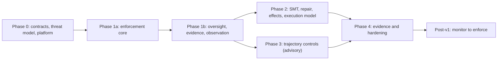

# Neuroharness Work Breakdown and Phase Plan

**Status:** Draft v0.2 — re-baselined after round-two review · **Date:** 2026-09-18 · **Implements:** `02-technical-plan.md` · **Cadence:** two-week iterations, trunk-based, every task Done per the Definition of Done in `06-delivery-and-governance.md` §6

## 0. Planning assumptions and capacity

| Assumption | Value |
|---|---|
| Team | 1 tech lead/architect, 2 backend engineers, 1 policy/security engineer (50%), 1 evaluation engineer (50%), product owner (25%), SRE (25%) |
| Duration | **24 weeks to v1.0** (was 17; re-baselined below) |
| Sizing | S ≤ 2 days · M ≤ 5 days · L ≤ 10 days (one engineer) |
| Utilization | 70–75% after review, Definition-of-Done overhead and interrupts |

**Why 17 weeks was not achievable.** Summing the v0.1 breakdown at upper-bound sizes gave ~251 engineer-days against ~230 available, before the work that was missing entirely (fact providers, key management, runbooks, corpora, performance environment, tenancy, HA) added roughly 70 more. The critical path alone ran ~73 serial days plus three weeks of mandatory shadow observation, which is 17.6 weeks with zero slack and zero rework. Phase 3 asked for ~34 days of work inside a 15-day window because the evaluation plan itself requires two weeks of benign shadow traffic before a monitor may be promoted.

**What changed.** Phase 1 splits into 1a and 1b; monitor promotion to `enforce` moves out of v1.0 (the monitor ships advisory, with precedence enforced at token issue and mutual exclusion by the broker lease, so the two highest-value temporal properties do not wait); the bypass exercise splits across two phases; and the missing tasks are added with owners.

Timeline: Phase 0 weeks 1–3 · Phase 1a weeks 4–9 · Phase 1b weeks 10–13 · Phase 2 weeks 14–18 · Phase 3 weeks 17–21 (overlaps Phase 2) · Phase 4 weeks 21–24.

## Phase 0 — Scope, contracts, threat model and platform (weeks 1–3)

| ID | Task | Size | Depends on | Requirements | Acceptance criteria |
|---|---|---|---|---|---|
| `P0-01` | Ratify constitution; resolve `OQ-01`, open `OQ-08` (research provenance) | S | — | `INV-01`, `INV-02` | Constitution v1.0 signed by tech lead and security lead; mapping recorded. |
| `P0-02` | Select reference workflow (`OQ-02`) | S | — | §3.5 | Decision memo on cost-of-failure, fact-provider availability, approver availability; `ADR-0011`. |
| `P0-03` | Define and classify workflow invariants incl. the `WF-06a/b/c` split | M | `P0-02` | `WF-01`–`WF-06c`, `FR-32` | Each invariant has class, statement, critic, fact dependencies, fixture ID, and a note on whether it needs state. |
| `P0-04` | Freeze envelope and decision-record schemas v1.1 (two digests, token/effect/completion records) | M | `P0-03` | `FR-02`–`FR-04`, `FR-70`–`FR-72` | Schemas validate positive and negative samples; digest test vectors published; schema tests in CI. |
| `P0-05` | Action-class registry format and initial entries (argument schemas, effect classes, resource keys) | M | `P0-03`, `P0-04` | `FR-30`–`FR-35` | Pydantic model + generated JSON Schema; signed sample registry; loader rejects inconsistent entries. |
| `P0-06` | Fact-provider specification incl. `asserted_by` and the anti-laundering rule | M | `P0-02` | `FR-10`–`FR-14`, `SEC-11` | Provider registry format; auth model; TTLs; for each provider, a statement of which tools can write to its backing system. |
| `P0-07` | Threat-model review and sign-off (now `T-01`–`T-26`) | M | `P0-04`–`P0-06` | `04-threat-model.md` | Every threat has a control or an accepted residual with an owner. |
| `P0-08` | Ratify verdict semantics, safety order and failure-mode table | S | `P0-03` | §5, §7 | Input→verdict matrix enumerated and checked in as fixtures. |
| `P0-09` | Mutation matrix `MUT-01`–`MUT-36` with lifecycle states and labelling protocol | M | `P0-03`, `P0-08` | `INV-07`, `05-evaluation-plan.md` §1a, §3–4 | Every hard gate has a reserved fixture; activation rule agreed; labelling protocol approved. |
| `P0-10` | Repository and CI: `uv`, pre-commit, 12 stages, CodeQL, gitleaks, SBOM, provenance, Scorecard, branch protection, agent-commit signing decision | **L** | — | `06` §3–4 | Empty-package pipeline green with all stages; signing restricted to main/tags. |
| `P0-11` | Licence and contribution model, including the GPL constraint on temporal tooling (`OQ-09`) | S | — | — | LICENSE, CONTRIBUTING, `ADR-0012`. |
| `P0-12` | Team, RACI, named roles (`OQ-10`), environments | M | — | `06` §8 | Workflow owner, second security reviewer, compliance and agent-developer contacts, override group all named. |
| `P0-13` | **Provision KMS (algorithm per `OQ-03`), object storage, staging cluster, CI service identities** | M | — | `NFR-17`, `SEC-12` | Keys creatable and rotatable; mTLS identities issued; `OQ-03` closed in Phase 0, not Phase 1. |
| `P0-14` | **Synthetic fixture and envelope generators** | M | `P0-04` | `05` §4 | `nh fixtures gen` produces valid and mutated envelopes; used by every later fixture task. |

**Exit gate P0:** schemas frozen · registry and provider formats signed · threat model signed · mutation matrix complete with states · CI skeleton green · KMS and environments provisioned · roles named.

## Phase 1a — Enforcement core (weeks 4–9)

| ID | Task | Size | Depends on | Requirements | Acceptance criteria |
|---|---|---|---|---|---|
| `P1-01a` | MCP gateway: tool advertisement, interception, authenticated host, server-derived session IDs | L | `P0-05`, `P0-13` | `FR-01`, `FR-06`, `SEC-12` | Direct tool access impossible in the stack; `MUT-25` reserved→active. |
| `P1-01b` | Hook adapter (only if `OQ-04` says yes) | M | `P1-01a` | `FR-01` | One framework integrated, or the task is formally deferred. |
| `P1-02` | Envelope builder: strip, validate argument schema, proposal/context split | M | `P0-04`, `P0-05` | `FR-02`, `FR-03` | `MUT-07`, `MUT-30` active and killed. |
| `P1-03` | Canonicalization, **two digests**, stamping | S | `P0-04` | `FR-04` | Digest vectors match; canonicalization idempotent under property test. |
| `P1-04` | PDP integration: signed bundles, input builder (facts only), rule inventory, outcome mapping | L | `P0-05`, `P1-18` | `FR-50`, `SEC-01`, `SEC-05` | Unsigned bundle refused; input has no claims; passing rules recorded; `MUT-17` active and killed. |
| `P1-05` | Verdict resolver with safety order and monotonicity property | M | `P0-08` | `FR-05`, §5.3–5.5 | Full matrix passes; hypothesis monotonicity passes. |
| `P1-06a` | Evidence store: append-only, hash chain, write-ahead, local WAL | L | `P0-04` | `FR-70`, `NFR-05`, `NFR-12` | Updates rejected; `MUT-13`, `MUT-21` killed. |
| `P1-06b` | Checkpoints, export, pseudonymization, crypto-shredding, retention | M | `P1-06a` | `FR-73`, `FR-74`, `NFR-16` | Chain verifier passes; export round-trips; shredding preserves the chain. |
| `P1-07` | Token service: payload with verdict/mode, KMS keys, nonce store, revocation list | M | `P1-06a`, `P0-13` | `FR-20`, `FR-22`, `FR-23`, `SEC-03` | `MUT-09`, `MUT-20`, `MUT-36` killed; concurrent double-consume test passes. |
| `P1-08` | Broker/PEP: digest recompute, full token checks, **resource lease**, connector, result typing, receipts | L | `P1-07` | `FR-21`, `FR-24`, `FR-25`, `FR-63` | `MUT-10`, `MUT-31` killed; duplicate delivery distinguished from replay. |
| `P1-09` | Registry loader, strictness modes, `halted`, hot reload, consistency rejection | M | `P0-05` | `FR-31`, `FR-33`, `FR-49`, `FR-83` | `A-19`, `MUT-19` pass; reload atomic under load. |
| `P1-11` | Failure-mode handling across all modes incl. clock and health | M | `P1-04`, `P1-06a` | §7, `NFR-11`–`NFR-13`, `FR-82` | `MUT-12`, `MUT-12b`, `A-22`, `A-28` pass. |
| `P1-12` | Verifier isolation: sandboxing, deny-all egress, typed output filter | M | `P1-04` | `FR-60`, `FR-61`, `SEC-07` | Egress test proves isolation; non-enumerated string rejected. |
| `P1-15` | Policy pack v1 (`WF-01`–`WF-05`, `WF-06b`), coverage, Regal, fixtures | L | `P1-04` | `INV-07`, `SEC-06` | 100% kill on active fixtures; ≥ 95% rule coverage; two-person review. |
| `P1-18` | **Fact providers v1: interface, five providers plus `harness_approval`, cache, staleness, error mapping, stubs** | L | `P0-06` | `FR-10`–`FR-14`, `SEC-11` | `MUT-04`, `MUT-14`, `MUT-23` killed; stale facts arrive as value-less stubs. |
| `P1-27` | Schema and database migration tooling | S | `P0-04` | — | Migrations run forward and back in CI. |

**Exit gate P1a:** an envelope can be proposed, evaluated, recorded, tokenized and executed under enforcement, fail-closed in every mode · `MUT-01`–`MUT-05`, `MUT-07`, `MUT-09`, `MUT-10`, `MUT-12`, `MUT-12b`, `MUT-13`, `MUT-14`, `MUT-19`–`MUT-21`, `MUT-23`, `MUT-25`, `MUT-30`, `MUT-31`, `MUT-36` active and killed. Note: `MUT-17` moved to `P1-04` (PDP integration).

## Phase 1b — Oversight, evidence and observation (weeks 10–13)

| ID | Task | Size | Depends on | Requirements | Acceptance criteria |
|---|---|---|---|---|---|
| `P1-10a` | Approval service: state machine, proposal-digest binding, TTL, supersession, REST/CLI | L | `P1-06a`, `P1-18` | `FR-40`–`FR-42`, `FR-44`–`FR-46` | `MUT-11`, `MUT-33`, `MUT-34` killed. |
| `P1-10b` | Approval disclosure UI, identity-provider eligibility, disclosure digest | M | `P1-10a` | `FR-43` | Approver sees and signs exactly what is recorded. |
| `P1-29` | **Approval re-evaluation flow** (fresh facts, `harness_approval` fact, void path) | M | `P1-10a`, `P1-18` | `FR-47` | `MUT-22` killed; `A-27`, `A-29` pass. |
| `P1-13` | Observability: traces, metrics incl. abstain-by-reason, dashboards, alerts | M | `P1-08` | `FR-81`, `NFR-18`, `NFR-21` | Dashboard live; correlated-failure alert fires in a drill. |
| `P1-16` | Replay harness and golden corpus v1 (record timestamp as "now") | M | `P1-04`, `P1-05`, `P1-06a` | `FR-71`, `NFR-07` | 100% reproduction; runs in CI. |
| `P1-19` | **Label store, sampling job, weekly shadow report** | M | `P1-06a`, `P1-13` | `05` §3 | Labels stored outside the chain; first report produced. |
| `P1-20` | **Key rotation: multi-active key IDs, rotation runbook and test** | M | `P1-07` | `NFR-17` | Rotation with no downtime demonstrated. |
| `P1-21` | **Tenant provisioning: scoping, per-tenant keys, crypto-shred test** | M | `P1-06b` | `NFR-15` | Cross-tenant access test fails closed. |
| `P1-22` | **PostgreSQL HA, backup and restore for evidence, nonces, leases, monitor state** | M | `P1-06a` | `NFR-10` | Failover drill; restore verified. |
| `P1-23` | **Runbooks batch 1** (token replay, integrity failure, evidence down, provider outage) | M | `P1-11`, `P1-13` | `06` §11 | Each runbook exercised in a drill. |
| `P1-24` | **Domain and benign trajectory corpora** | M | `P1-14` | `05` §5, §6 | Corpora checked in with provenance; used by `P2-05` and `P3-04`. |
| `P1-25` | **Performance environment, stubs and load profiles** | M | `P1-08` | `NFR-01`–`NFR-04` | p95 policy-only latency measured; chain-contention profile produced. |
| `P1-26` | **Reference agent, staging deployment target and connector environment** | M | `P1-08` | — | A real agent drives the workflow end to end. |
| `P1-28` | **TCB security review** | M | `P1-08`, `P1-12` | `04` §3 | Findings filed; blockers closed. |
| `P1-14` | Shadow run ≥ 1 week on the reference workflow, labelled | M | `P1-15`, `P1-09`, `P1-18`, `P1-26` | `FR-80` | `MUT-16` killed; report with verdict distribution and labelled false-block rate. |
| `P1-17` | Phase 1 exit review | S | all | — | Exit gate met; retrospective. |

**Exit gate P1b:** approval path complete with re-evaluation · replay 0 diffs · p95 policy-only latency ≤ 100 ms measured on `P1-25` at 1× load (`NFR-01` re-baselined only by ADR) · one-week labelled shadow run · no `ALLOW` path without a token, proven by `MUT-20`/`MUT-36` plus a static check that only the token service can construct a token · TCB security review closed · **residual recorded:** `WF-06a` enforced at token issue only, general ordering not yet monitored.

## Phase 2 — Symbolic verification, repair and effects (weeks 14–18)

| ID | Task | Size | Depends on | Requirements | Acceptance criteria |
|---|---|---|---|---|---|
| `P2-01` | SMT critic framework: contract DSL, Z3, **rlimit-primary bounding**, version-tuple pre-parsing | L | `P1-05` | `FR-51`, `FR-55`, `FR-56` | `MUT-08` killed; deterministic across 100 runs and across CI load. |
| `P2-02` | Repair loop: typed counterexamples, `action_id` linkage, budget, rate limit | M | `P2-01`, `P1-05` | `FR-90`–`FR-93`, §5.4 | `MUT-15`, `MUT-35` killed; `A-26` passes. |
| `P2-03` | Latency benchmark of the SMT path; tune or move off the synchronous path | M | `P2-01`, `P1-25` | `NFR-02` | p95/p99 reported; thresholds become blocking. |
| `P2-05` | Repair-success and cost measurement on replayed trajectories | M | `P2-02`, `P1-24` | `FR-92`, `NFR-22` | Per-class report; hypotheses replaced by measurements. |
| `P2-06` | Code-mutation gate (pure packages per PR, full TCB nightly) | S | `P1-17` | `02` §8 | Gate active without blowing PR time. |
| `P2-08` | **Solver upgrade procedure and replay re-validation** | S | `P2-01`, `P1-16` | `NFR-07`, `R-13` | Documented; exercised on one Z3 bump. |
| `P2-09` | **Bypass exercise round 1** (tokens, envelope substitution, claims, approval, fact laundering) | L | `P1-29`, `P2-02` | `05` §7 | Findings fixed or accepted; new fixtures added. |
| `P2-10` | **Execution model: async connectors, completion facts, retries, idempotency, batches** | L | `P1-08` | `FR-07`, `FR-26`, `FR-27` | `MUT-27`, `MUT-28` killed; `A-32`, `A-33` pass. |
| `P2-11` | **Effect critic and state-fact comparison** | M | `P2-10`, `P1-18` | `FR-57` | `MUT-32` killed; `A-38` passes. |
| `P2-12` | **Bundle-transition semantics** (pending approvals, monitor state, token currency) | M | `P1-09`, `P1-29` | `FR-84` | `MUT-29` killed; `A-37` passes. |
| `P2-04` | Prolog critic (optional; only if an owner is named) | M | `P1-12` | `FR-62` | Gateway-invoked only, no agent query path; otherwise formally deferred. |
| `P2-07` | Phase 2 exit review | S | all | — | Exit gate met. |

**Exit gate P2:** no implicit allow on `UNKNOWN`/`TIMEOUT` proven by fixture and property test · SMT latency within blocking thresholds · repair and effect metrics published · execution model covers the asynchronous reference workflow · bypass round 1 closed.

## Phase 3 — Trajectory controls (weeks 17–21, overlapping Phase 2)

| ID | Task | Size | Depends on | Requirements | Acceptance criteria |
|---|---|---|---|---|---|
| `P3-01` | Temporal property language and DFA compiler (build vs vendor per `ADR-0013`); encode `WF-06a` | L | `P1-05`, `P0-11` | `FR-52` | Automata checked in with tests; licence constraint respected. |
| `P3-02` | Monitor state: persistence, property-set versioning, session-tree and resource-key scoping, restore | M | `P3-01`, `P1-06a`, `P1-08`, `P1-10a` | `FR-52`, `NFR-14` | `A-23` passes; state loss abstains; sub-agent scoping tested. |
| `P3-03` | Adversarial trajectory corpus generator, sized by the entropy sample rule, with an LLM budget line | **L** | `P1-14`, `P1-24` | `05` §6 | ≥ 51 or ≥ 226 trajectories per governed model with provenance. |
| `P3-04` | Entropy preflight, coverage and false-block measurement; certification record | M | `P3-02`, `P3-03` | `FR-53` | Certification record stored in the registry. |
| `P3-05` | Re-certification trigger, automatic demotion, model-change runbook | S | `P3-04` | `FR-54` | Mismatch demotes to advisory (tested). |
| `P3-07` | **Runbooks batch 2** (bypass, demotion vs halt, key rotation, effect mismatch) | S | `P3-05` | `06` §11 | Exercised in a drill. |
| `P3-06` | Phase 3 exit review | S | all | — | Exit gate met. |

**Exit gate P3:** monitor operating in **advisory** with a certification record and a measured false-block rate · `MUT-24` killed in shadow evaluation · re-certification trigger tested · promotion to `enforce` explicitly deferred to `P5-01` with the residual recorded.

## Phase 4 — Product evidence and hardening (weeks 21–24)

| ID | Task | Size | Depends on | Requirements | Acceptance criteria |
|---|---|---|---|---|---|
| `P4-01` | Reference evidence pack (policy pack, fixtures, dashboards, sample records, chain verifier) | M | `P3-06` | — | Reproducible from a clean checkout by script. |
| `P4-02` | Audit export validation against the compliance mapping, auditor walkthrough | M | `P1-06b` | `FR-73`, `06` §7 | Gaps logged; mapping marked indicative pending counsel. |
| `P4-03` | τ²-bench harness-on vs harness-off: one domain, ≤ 30 tasks, k = 3, explicit cost line | L | `P2-07` | `05` §5 | Report with violation rate, false-block rate, `pass^k` as regression guard, latency, limitations. |
| `P4-04` | Scoped performance-claims document (measured values only) | S | `P4-03` | Art. X | Coverage, bypass conditions, percentiles, unsupported domains, evidence class per number. |
| `P4-05` | **Bypass exercise round 2** (monitor, adapter bypass, race, session laundering, override abuse) — external red team | L | `P3-06`, `P2-09` | `05` §7 | Findings fixed or accepted with owners; fixtures `MUT-40+`. |
| `P4-07` | **Operator and integrator documentation, OpenAPI, onboarding guide** | M | `P1-26` | `NFR-09` | A new agent developer integrates in ≤ 1 day, measured. |
| `P4-06` | v1.0 release, changelog, retrospective | S | all | — | Tag signed; SBOM and provenance published. |

**Exit gate P4 / v1.0:** all blocking CI gates green · evidence pack published · both bypass rounds closed · claims document reviewed by security and product · residuals (advisory monitor, provider trust, business-hours support) stated in the release notes.

## Post-v1 backlog
`P5-01` promote the trajectory monitor to `enforce` after certification · additional workflows (data migration, refunds) · chat-ops approvals · in-process WASM PDP with a dual-evaluator conformance suite · probabilistic or learned monitors for high-entropy governed models · reasoning-trace verification (research track) · knowledge-graph critics where a stable ontology exists (`ADR-0005`).

## Dependency overview

