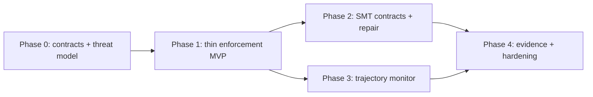

# Neuroharness Work Breakdown and Phase Plan

**Status:** Draft v0.1 · **Date:** 2026-09-18 · **Implements:** `02-technical-plan.md` · **Cadence:** two-week iterations, trunk-based, every task Done per the Definition of Done in `06-delivery-and-governance.md` §6

## 0. Planning assumptions

| Assumption | Value |
|---|---|
| Team | 1 tech lead/architect, 2 backend engineers, 1 policy/security engineer (50%), 1 evaluation engineer (50%), product owner (25%), SRE (25%) |
| Duration | ~17 weeks to v1.0 (indicative; re-baselined at each phase exit) |
| Sizing | S ≤ 2 days · M ≤ 5 days · L ≤ 10 days (one engineer) |
| Definition of a phase exit | All exit-gate criteria met and reviewed; no open `blocking` risk; retrospective held |

Timeline: Phase 0 weeks 1–2 · Phase 1 weeks 3–7 · Phase 2 weeks 8–11 · Phase 3 weeks 12–14 · Phase 4 weeks 15–17.

## Phase 0 — Scope, contracts and threat model (weeks 1–2)

Goal: freeze what v1 governs, the data contracts, and the trust model before writing runtime code.

| ID | Task | Size | Depends on | Requirements | Acceptance criteria |
|---|---|---|---|---|---|
| `P0-01` | Ratify constitution; resolve `OQ-01` (upstream `INV-16`/`DEC-008` mapping) | S | — | `INV-01`, `INV-02` | Constitution v1.0 signed by tech lead and security lead; mapping recorded in spec §4. |
| `P0-02` | Select reference workflow (`OQ-02`) | S | — | §3.5 | Decision memo comparing deployment / migration / refund on cost-of-failure, fact-provider availability, approver availability; ADR-0011 written. |
| `P0-03` | Define and classify the six workflow invariants | M | `P0-02` | `WF-01`–`WF-06`, `FR-32` | Each invariant has class, NL statement, intended critic, fact dependencies, and a mutation fixture ID. |
| `P0-04` | Freeze envelope and decision-record schemas v1 | M | `P0-03` | `FR-02`–`FR-04`, `FR-70`, `FR-72` | Schemas validate sample documents; digest test vectors published; schema tests in CI. |
| `P0-05` | Action-class registry format and initial entries | M | `P0-03`, `P0-04` | `FR-30`–`FR-33` | Pydantic model + generated JSON Schema; signed sample registry; loader rejects unsigned/mismatched registry. |
| `P0-06` | Identify and specify fact providers (CI, approvals, deploy state, clock, identity) | M | `P0-02` | `FR-10`–`FR-13`, `SEC-09` | Provider interface spec; auth model; TTLs and max ages per rule; TCB inventory updated. |
| `P0-07` | Threat-model review and sign-off | M | `P0-04`–`P0-06` | `04-threat-model.md` | All `T-` items have a control or an accepted residual risk with owner. |
| `P0-08` | Ratify verdict semantics and failure-mode table | S | `P0-03` | §5, §7 | Table-driven test matrix enumerated (input → verdict) and checked into `fixtures/`. |
| `P0-09` | Draft mutation matrix `MUT-01`–`MUT-18` and labelling protocol | M | `P0-03`, `P0-08` | `INV-07`, `05-evaluation-plan.md` §3–4 | Every hard gate has ≥ 1 fixture ID; false-block labelling protocol approved. |
| `P0-10` | Repository bootstrap: `uv`, pre-commit (ruff, mypy strict, bandit), CI skeleton, CodeQL, gitleaks, SBOM, provenance, Scorecard | M | — | `06-delivery-and-governance.md` §3–4 | Empty-package pipeline green with all stages present; branch protection on `main`. |
| `P0-11` | License and contribution model decision | S | — | — | LICENSE and CONTRIBUTING added; ADR-0012. |
| `P0-12` | Confirm team, RACI, environments (dev Compose, staging cluster) | S | — | `06-delivery-and-governance.md` §8 | RACI table filled; environments reachable from CI. |

**Exit gate P0:** schemas frozen (v1) · registry format signed · threat model signed · mutation matrix complete · CI skeleton green · reference workflow chosen.

## Phase 1 — Thin enforcement MVP (weeks 3–7)

Goal: end-to-end policy-only enforcement on the reference workflow, fail-closed, with tokens, records, approvals and mutation fixtures, running in shadow mode against a real agent.

| ID | Task | Size | Depends on | Requirements | Acceptance criteria |
|---|---|---|---|---|---|
| `P1-01` | MCP gateway: tool advertisement and interception; decide/implement hook adapter (`OQ-04`) | L | `P0-05` | `FR-01` | Agent host configured only with gateway; direct tool access impossible in the Compose stack; `A-25` passes through gateway. |
| `P1-02` | Envelope builder: proposal/context split, context-key stripping | M | `P0-04` | `FR-03` | `MUT-17` killed; stripping is recorded. |
| `P1-03` | Canonicalization (JCS), digest, stamping (`action_id` UUIDv7, versions) | S | `P0-04` | `FR-04` | Digest test vectors match; property test: canonicalization idempotent. |
| `P1-04` | PDP integration: OPA sidecar, signed bundle loading, input-document builder (facts only), outcome mapping | L | `P0-05`, `P0-06` | `FR-50`, `SEC-01`, `SEC-05` | Unsigned bundle refused; input doc schema asserts no `claims`; rule outcomes recorded individually. |
| `P1-05` | Verdict resolver | M | `P0-08` | `FR-05`, §5.3–5.5 | Table-driven matrix from `P0-08` passes; hypothesis monotonicity property passes. |
| `P1-06` | Evidence store: append-only table, hash chain, write-ahead, export, checkpoint | L | `P0-04` | `FR-70`–`FR-74`, `SEC-10`, `NFR-05`, `NFR-16` | Update/delete rejected by trigger; chain verifier passes; export round-trips; `MUT-13` killed. |
| `P1-07` | Token service: issue/verify/consume, KMS-backed key (`OQ-03`), nonce table | M | `P1-06` | `FR-20`, `FR-22`, `FR-23`, `SEC-03`, `NFR-17` | `MUT-09` killed; concurrent double-consume test passes (`NFR-14`). |
| `P1-08` | Broker/PEP: digest recompute, token verify+consume, connector for deployment tool, result typing, receipts | L | `P1-07` | `FR-21`, `FR-24`, `FR-63`, `SEC-02`, `SEC-08` | `MUT-10` killed; result exceeding size bound truncated and tagged; receipt appended. |
| `P1-09` | Registry loader, strict/permissive modes, hot reload | M | `P0-05` | `FR-31`, `FR-83` | `A-19` passes; reload is atomic under load test. |
| `P1-10` | Approval service: state machine, eligibility, TTL, digest binding, REST + CLI + minimal page | L | `P1-06`, `P1-07` | `FR-40`–`FR-46`, `SEC-04` | `MUT-11`, `MUT-18` killed; `A-27` passes. |
| `P1-11` | Failure-mode handling: PDP down, bundle integrity, evidence down, clock, provider timeouts | M | `P1-04`, `P1-06` | §7, `NFR-10`–`NFR-13`, `FR-82` | `MUT-12`, `A-12`–`A-14`, `A-22` pass; health endpoint reflects each condition. |
| `P1-12` | Verifier isolation: sandboxed PDP/critic workers, deny-all egress, typed output filter | M | `P1-04` | `FR-60`, `FR-61`, `SEC-07` | Network policy test proves no egress; string field outside schema rejected. |
| `P1-13` | Observability: OTel traces, metrics, dashboards, initial alerts; latency measurement | M | `P1-01`–`P1-08` | `FR-81`, `NFR-01`, `NFR-04`, `NFR-18` | Dashboard shows verdicts/latency; p95 policy-only latency reported against `NFR-01`. |
| `P1-14` | Rollout modes; shadow run against a real agent on the reference workflow for ≥ 1 week (`OQ-06`) | M | `P1-08`, `P1-13` | `FR-80` | `MUT-16` killed; shadow report: verdict distribution, false-block candidates labelled per protocol. |
| `P1-15` | Policy pack v1: Rego for `WF-01`–`WF-05`, `opa test` coverage, Regal, fixtures `MUT-01`–`MUT-05`, `MUT-07`, `MUT-14`, `MUT-17` | L | `P1-04` | `INV-07`, `SEC-06` | 100% mutation kill; ≥ 95% rule coverage; two-person review recorded. |
| `P1-16` | Replay harness and golden corpus v1 | M | `P1-06` | `FR-71`, `INV-09`, `NFR-07` | `nh replay` reproduces 100% of corpus; runs in CI. |
| `P1-17` | Phase 1 exit review | S | all | — | Exit gate met; retrospective. |

**Exit gate P1:** 100% mutation kill on `MUT-01`–`MUT-05`, `MUT-07`, `MUT-09`–`MUT-14`, `MUT-16`–`MUT-18` · replay 0 diffs · p95 policy-only latency measured and ≤ 2× `NFR-01` (target itself re-baselined) · one-week shadow run analysed · no `ALLOW` path without token proven by test · security review of TCB.

## Phase 2 — Narrow symbolic verification (weeks 8–11)

Goal: add bounded SMT contracts, typed counterexamples and the repair loop; prototype the read-only Prolog critic; prove `unknown` never allows.

| ID | Task | Size | Depends on | Requirements | Acceptance criteria |
|---|---|---|---|---|---|
| `P2-01` | SMT critic framework: contract DSL → Z3 (QF_LIA/QF_BV), timeouts, seeds, worker limits; version and quota contracts for the reference workflow | L | `P1-05` | `FR-51`, `FR-55`, `FR-56` | `MUT-08` killed; counterexample lists offending variables; deterministic across 100 runs. |
| `P2-02` | Repair loop: typed counterexample response, budget, iteration linking | M | `P2-01`, `P1-05` | `FR-90`–`FR-91` | `MUT-15` killed; `A-26` passes. |
| `P2-03` | Latency benchmark of the SMT path; tune or move contracts off the synchronous path | M | `P2-01`, `P1-13` | `NFR-02` | p95/p99 reported; thresholds set as blocking. |
| `P2-04` | Prolog read-only verifier prototype (harness-owned signed rulebase, query-only MCP wrapper) as soft critic | M | `P1-12` | `FR-62`, `FR-61` | Interface exposes only `query`; attempt to consult/assert is impossible by test; explanations recorded. |
| `P2-05` | Repair-success and iterations-to-allow measurement on replayed trajectories | M | `P2-02`, `P1-16` | `FR-92` | Report per action class; hypothesis targets in `05-evaluation-plan.md` §3 updated with measured values. |
| `P2-06` | Code-mutation score made blocking (mutmut ≥ 80% on TCB) | S | `P1-17` | `02-technical-plan.md` §8 | CI gate active. |
| `P2-07` | Phase 2 exit review | S | all | — | Exit gate met. |

**Exit gate P2:** `MUT-08`, `MUT-15` killed · no implicit allow on `UNKNOWN`/timeout proven by fixture and property test · SMT latency within blocking thresholds · repair metrics published · Prolog critic isolated and soft.

## Phase 3 — Trajectory controls (weeks 12–14)

Goal: enforce ordering invariants that stateless policy cannot express, but only after measuring coverage and false-block rate.

| ID | Task | Size | Depends on | Requirements | Acceptance criteria |
|---|---|---|---|---|---|
| `P3-01` | Temporal property language (LTLf subset) and DFA compiler; encode `WF-06` | L | `P1-05` | `FR-52` | Compiled automata checked in with tests; `MUT-06` killed in shadow evaluation. |
| `P3-02` | Monitor state persistence, restore, resource-key serialization | M | `P3-01`, `P1-06` | `FR-52`, `NFR-14` | `A-23`, `A-24` pass; state loss yields `ABSTAIN`. |
| `P3-03` | Adversarial trajectory corpus generator for the reference workflow (red-team prompts + synthetic mutations), sized by the entropy sample-complexity rule | M | `P1-14` | `05-evaluation-plan.md` §6 | ≥ 51 trajectories for low-entropy or ≥ 226 for high-entropy backends per governed model; provenance recorded. |
| `P3-04` | Entropy preflight, coverage and false-block measurement; certification record | M | `P3-02`, `P3-03` | `FR-53` | Certification record (model identity, entropy estimate, coverage, false-block rate, decision) stored in registry. |
| `P3-05` | Promotion to `enforce` where certified; re-certification trigger on model change; runbook | S | `P3-04` | `FR-54` | Mismatch of governed model demotes monitor to advisory (tested); runbook published. |
| `P3-06` | Phase 3 exit review | S | all | — | Exit gate met. |

**Exit gate P3:** monitor certified or explicitly left in advisory with rationale · `MUT-06` killed in enforce mode where certified · false-block rate within threshold · re-certification trigger tested.

## Phase 4 — Product evidence and hardening (weeks 15–17)

| ID | Task | Size | Depends on | Requirements | Acceptance criteria |
|---|---|---|---|---|---|
| `P4-01` | Reference evidence pack: policy pack, fixtures, dashboards, sample records, chain verifier | M | `P3-06` | Research §Product positioning | Pack reproducible from a clean checkout by script. |
| `P4-02` | Audit export format validation against compliance mapping | M | `P1-06` | `FR-73`, `06-delivery-and-governance.md` §7 | Auditor persona walkthrough completed; gaps logged. |
| `P4-03` | τ²-bench harness-on vs harness-off protocol and run (policy subset translated to Rego) | L | `P2-07` | `05-evaluation-plan.md` §5 | Report with violation rate, false-block rate, `pass^k`, latency; limitations stated. |
| `P4-04` | Scoped performance-claims document | S | `P4-03` | Art. X | Claims list coverage, bypass conditions, latency percentiles, unsupported domains. |
| `P4-05` | Adversarial/bypass exercise (tampering, replay, substitution, result injection, approval abuse, adapter bypass) and fixes | L | `P3-06` | `05-evaluation-plan.md` §7 | All findings fixed or accepted with owner; new fixtures added. |
| `P4-06` | v1.0 release, changelog, retrospective | S | all | — | Tag signed; SBOM and provenance published. |

**Exit gate P4 / v1.0:** all blocking CI gates green · evidence pack published · bypass exercise closed · claims document reviewed by security and product.

## Dependency overview

## Deferred backlog (post-v1)
- Additional workflows (data migration, refunds) reusing the registry and policy pack structure.
- Chat-ops approval integrations.
- In-process WASM PDP for library deployments.
- Reasoning-trace verification (research track, `ADR-0002` boundary).
- Knowledge-graph/SHACL critics where a stable domain ontology exists (`ADR-0005`).
- Probabilistic or learned trajectory monitors for high-entropy governed models (per the entropy-coverage result).
